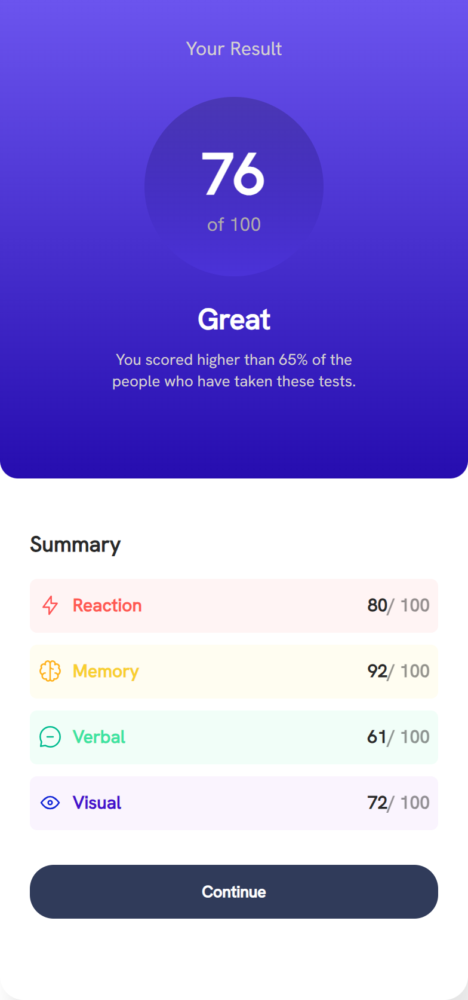

 
Hi i'm Tolu and this is my solution to the [Results summary component challenge on Frontend Mentor](https://www.frontendmentor.io/challenges/results-summary-component-CE_K6s0maV). Frontend Mentor challenges help you improve your coding skills by building realistic projects. 

## Table of contents

- [Overview](#overview)
  - [The challenge](#the-challenge)
  - [Screenshot](#screenshot)
  - [Links](#links)
- [My process](#my-process)
  - [Built with](#built-with)
  - [What I learned](#what-i-learned)
  - [Useful resources](#useful-resources)
- [Author](#author)

## Overview

### The challenge

Users should be able to:

- View the optimal layout for the interface depending on their device's screen size
- See hover and focus states for all interactive elements on the page
- 

### Screenshot

### Links

- Solution URL: [Add solution URL here](https://your-solution-url.com)
- Live Site URL: [Add live site URL here](https://your-live-site-url.com)

## My process
Firstly,i examined the designs to start planning out how to tackle the project.
After i was done examining the design i created the HTML structure of the project,i created a main container containing two containers and i added the necessary html content to each container in reference to the design.
Moving on to styling, i examined the style guide document to determine my fonts and colors and started appying the necessary styles to the body,maincontainer and the two containers. 
When i was done creating the layout i used media queries to adapt the layout to different screen sizes and that was how i successfully built this project.
Thank You!!!!

### I Built this project with

- Semantic HTML5 markup
- CSS custom properties
- Flexbox
- Desktop-first workflow

### What I learned
  I learnt more about css flexbox and i must add, i prefered using flexbox to grid in this project.
If you want more help with using flexbox, i recommend checking out Kevin Powell's youtube video regarding flexbox

### Useful resources

- [stackoverflow](https://www.stackoverflow.com) - This website really helped me with getting answers and solutions regarding problems i encountered while building the project ,on the website, they are tons of experienced developers who are willing to answer your questions. 
- [Kevin Powell's course on conquering responsive layou](https://courses.kevinpowell.co/conquering-responsive-layouts) - This is an amazing course for any one struggling with responsive layouts, i highly recommend it!

## Author

- Frontend Mentor - [tolulope_as](https://www.frontendmentor.io/profile/Tolulope-as)
- Instagram - [tolulope_as](https://www.instagram.com/tolulope_as)

